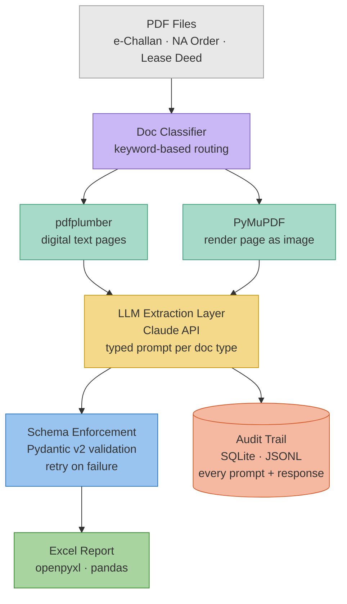

# 🗂️ Compliance Clerk — Intelligent Document Extraction Pipeline

> An LLM-powered pipeline that reads Indian legal and government PDFs
> the way a human would — and outputs clean, structured Excel reports.

---

## The Problem

Our operations team processes **hundreds of legal and government documents
every day** — e-Challans, NA Permission Orders, and Lease Deeds issued by
Gujarat's Revenue Department.

Every document is parsed **manually**. A person opens the PDF, reads it,
finds the relevant fields, and types them into a spreadsheet. This is:

| Pain Point | Impact |
|---|---|
| **Slow** | Each document takes 5–15 minutes by hand |
| **Error-prone** | Typos, missed fields, wrong date formats |
| **Unscalable** | Volume grows, team size doesn't |
| **Multilingual** | Documents mix English and Gujarati script |
| **Heterogeneous** | No two document layouts are identical |

---

## The Solution

A Python pipeline that:

1. **Ingests** any PDF from the supported document types
2. **Classifies** it automatically (e-Challan vs NA Order vs Lease Deed)
3. **Extracts** raw content — text for digital pages, images for Gujarati/scanned pages
4. **Sends** targeted prompts to Claude with strict JSON schema enforcement
5. **Validates** every LLM response with Pydantic before accepting it
6. **Writes** a formatted Excel report and logs everything for audit

---

## Supported Document Types

### 1. e-Challan
Registration fee receipts issued by the Inspector General of Registration,
Revenue Department, Government of Gujarat.

**Key fields extracted:**
`transaction_no` · `application_no` · `amount_inr` · `bank_cin` · `date`
· `bank_branch` · `payee_name` · `office_district` · `property_details`

---

### 2. NA Permission Order (Non-Agricultural)
Government orders permitting use of agricultural land for non-agricultural
(industrial/commercial) purposes. Written primarily in Gujarati.

**Key fields extracted:**
`order_number` · `survey_number` · `land_area_sqm` · `village` · `taluka`
· `district` · `lessee_name` · `lease_term` · `order_date` · `authority_name`

---

### 3. Lease Deed
Registered bilingual (English + Gujarati) lease agreements between a
landowner (Lessor) and a company (Lessee), registered at the Sub-Registrar's
office. Up to 54 pages.

**Key fields extracted:**
`deed_number` · `survey_number` · `lessor_name` · `lessee_name`
· `lessee_cin` · `execution_date` · `lease_term_years` · `stamp_duty_inr`
· `registration_fee_inr` · `sub_registrar_office`

---

## Architecture


---

## Key Design Decisions

### Smart page selection
The Lease Deed is 54 pages. We do **not** send all 54 pages to the LLM.
We identify and send only the 5–6 pages that contain the fields we need.
This cuts cost and latency by ~90%.

### Two-layer parsing
```
Digital PDF page  →  pdfplumber  →  raw text  →  LLM prompt
Image/Gujarati page  →  PyMuPDF render  →  PNG @2×  →  Claude vision
```
Gujarati text is extracted via Claude's native multilingual vision
capability — no external OCR library required.

### Schema enforcement
Every LLM response is validated by a Pydantic model before being
accepted. If the JSON doesn't match the schema:
```
LLM response → json.loads() → Pydantic model(**data)
                                        ↓
                          ValidationError caught
                                        ↓
                          Log to audit DB + retry once
                                        ↓
                          Write null for that field + continue
```
The pipeline **never crashes** on a bad LLM response.

### Audit trail
Every LLM call is logged to SQLite (or JSONL) with:
- the exact prompt sent
- the raw response received
- whether validation passed
- token counts (for cost tracking)

This makes every extraction fully debuggable and reproducible.

---

## Tech Stack

| Layer | Library | Why |
|---|---|---|
| PDF text extraction | `pdfplumber` | Best layout preservation for digital PDFs |
| PDF image rendering | `PyMuPDF` (fitz) | Fastest page-to-PNG renderer in Python |
| LLM | `anthropic` (Claude) | Native Gujarati · vision · JSON output |
| Schema validation | `pydantic` v2 | Fast, expressive, great error messages |
| Excel output | `openpyxl` + `pandas` | Industry standard |
| Audit store | `sqlite3` (stdlib) | Zero dependencies, portable |
| CLI | `argparse` (stdlib) | No extra dependency needed |

---

## Project Structure
```
compliance_clerk/
│
├── src/
│   ├── parsers/        # PDF → raw text or base64 image
│   ├── extractors/     # LLM prompts + response parsing per doc type
│   ├── models/         # Pydantic schemas for each document type
│   ├── audit/          # SQLite / JSONL logging
│   └── output/         # Excel report writer
│
├── data/
│   └── sample_pdfs/    # Input documents go here
│
├── tests/              # Unit tests + explorer scripts
│
├── process_docs.py     # CLI entry point
├── config.py           # All settings in one place
├── requirements.txt
└── README.md
```

---

## Setup
```bash
# Clone and enter the project
git clone <your-repo-url>
cd compliance_clerk

# Create and activate virtual environment
python -m venv .venv
source .venv/bin/activate        # Mac/Linux
# .venv\Scripts\activate         # Windows

# Install dependencies
pip install -r requirements.txt

# Set your API key
export ANTHROPIC_API_KEY=sk-ant-your-key-here
```

---

## Usage
```bash
# Process all PDFs in a folder
python process_docs.py --input ./data/sample_pdfs/ --output report.xlsx

# Process a single file with known type
python process_docs.py --file lease_deed.pdf --type lease_deed

# Use JSONL audit trail instead of SQLite
python process_docs.py --input ./data/ --output report.xlsx --audit-backend jsonl
```

---

## Output

The pipeline produces two artifacts:

**`report.xlsx`** — one sheet per document type, one row per document,
all extracted fields as columns.

**`audit.db`** — SQLite database with a full log of every LLM call:
prompt, response, validation result, token count, timestamp.

---

